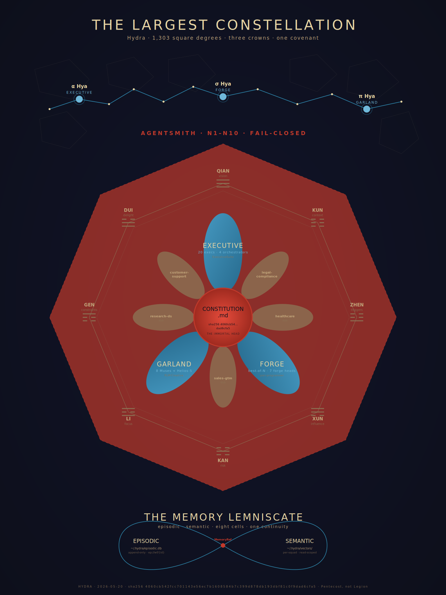
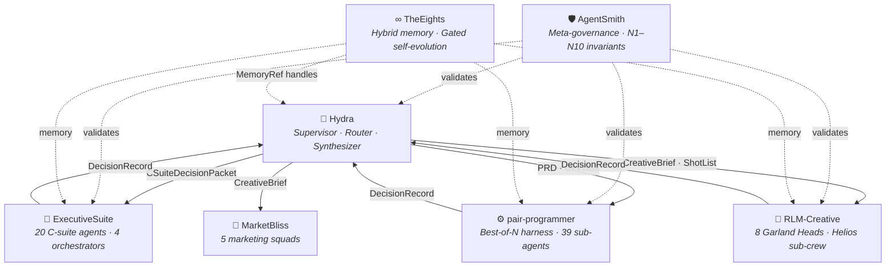
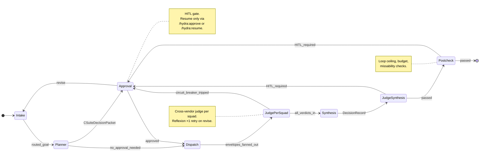
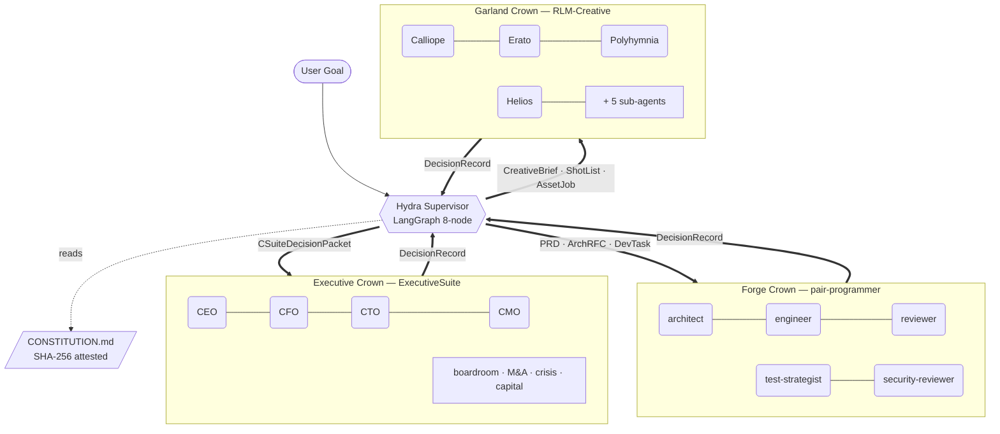

# Hydra — The Governed Constellation

> *Many heads. One Spirit. The covenant holds.*

A LangGraph supervisor that routes work across specialized AI agent squads — executive strategy, software engineering, creative production — under constitutional governance with human-in-the-loop gates, budget enforcement, and cross-model judging.


Hydra is a **Claude Code plugin + Python LangGraph supervisor** that routes work across a constellation of heterogeneous AI agent squads — Executive (C-suite strategy), Forge (engineering), Garland (creative), plus marketing operations and a roster of governance-ready stubs. It is **Pentecost, not Legion**: many distinct agents under one cryptographically-anchored covenant (`CONSTITUTION.md`), routed via typed envelopes, audited by [AgentSmith](https://github.com/lebobo88/AgentSmith), and tagged with the eight-cell I Ching vocabulary backed by the optional [TheEights](https://github.com/lebobo88/TheEights) memory daemon as a shared cross-project substrate.

Hydra does not re-implement the squads' work. It sits above them: classifying goals, decomposing them into typed cross-squad envelopes, dispatching subgraphs in parallel, synthesizing the result into a single decision record, and enforcing the constitutional rule of faith on every step.

---

<p align="center">
  
</p>

<p align="center"><em>The Pentecost flower sigil — central immortal head, three crown petals, eight-cell substrate. See <a href="docs/constellation/HYDRA-CONSTELLATION.md">docs/constellation/</a> for the full layered presentation, the <a href="docs/constellation/deck.html">reveal.js cinematic deck</a>, and <a href="docs/constellation/exec-memos/">executive memos</a>.</em></p>

---

## The Ecosystem

Hydra is one node in a governed constellation of six sibling projects. Each is independently shippable; together they form a unified AI operating system:



| Project | Role | Link |
|---|---|---|
| **Hydra** | Supervisor — routes, governs, synthesizes | *this repo* |
| **[ExecutiveSuite](https://github.com/lebobo88/ExecutiveSuite)** | Strategic decision support — 20 C-suite agents + boardroom/M&A/crisis/capital orchestrators | [GitHub](https://github.com/lebobo88/ExecutiveSuite) |
| **[pair-programmer](https://github.com/lebobo88/pair-programmer)** | Engineering harness — best-of-N, cross-vendor judging, 39 sub-agents, 16 profiles | [GitHub](https://github.com/lebobo88/pair-programmer) |
| **[RLM-Creative](https://github.com/lebobo88/RLM-Creative)** | Eight Garland Heads studio — 8 Muses + Helios photo/cinema sub-crew | [GitHub](https://github.com/lebobo88/RLM-Creative) |
| **[MarketBliss](https://github.com/lebobo88/MarketBliss)** | Marketing operations — 5 squads (strategy, creative, research, production, ops) | [GitHub](https://github.com/lebobo88/MarketBliss) |
| **[AgentSmith](https://github.com/lebobo88/AgentSmith)** | Meta-governance daemon — Factory / Inspector / Sentinel / Archivist, N1–N10 invariants | [GitHub](https://github.com/lebobo88/AgentSmith) |
| **[TheEights](https://github.com/lebobo88/TheEights)** | Persistent hybrid memory + governance + gated self-evolution substrate (optional) | [GitHub](https://github.com/lebobo88/TheEights) |

---

## Contents

- [What Hydra is](#what-hydra-is)
- [The Three Crowns](#the-three-crowns)
- [The Immortal Head, AgentSmith, and TheEights](#the-immortal-head-agentsmith-and-theeights)
- [MCP topology](#mcp-topology)
- [Prerequisites](#prerequisites)
- [Install](#install)
- [Slash commands](#slash-commands)
- [End-to-end example](#end-to-end-example)
- [Repository map](#repository-map)
- [What Hydra is not](#what-hydra-is-not)
- [Where to learn more](#where-to-learn-more)

---

## What Hydra is

1. A **LangGraph supervisor graph** running an 8-node state machine: `intake → planner → approval → dispatch → judge_per_squad → synthesis → judge_synthesis → postcheck`. Checkpointed via SQLite (`~/.hydra/checkpoints.db`); long workflows survive restarts.
2. A **squad registry** — every squad is described by `squads/<slug>/squad.yaml` and auto-discovered. Adding a squad is a config change, not a Hydra-core change.
3. A **typed cross-squad message bus** with ten Pydantic schemas: `CSuiteDecisionPacket`, `PRD`, `ArchRFC`, `DevTask`, `CreativeBrief`, `ShotList`, `AssetJob`, `DecisionRecord`, `HITLRequest`, `Handoff`. Validated fail-closed at every squad boundary (`hydra_core.schemas.validate_envelope`).
4. An **MCP host** that fans out to each squad's tool surface as an isolated MCP client session. Five MCP servers ship in this repo (see [§ MCP topology](#mcp-topology)).
5. A **local-first memory fabric** with three tiers — ephemeral (in-prompt), episodic (SQLite, `~/.hydra/episodic.db`), semantic (Chroma vector store, `~/.hydra/vectors/`) — provided by the in-repo `hydra-memory` MCP server. Cross-squad reads go through `MemoryRef` handles only. Optionally federates with the [TheEights](https://github.com/lebobo88/TheEights) daemon for cross-project hybrid memory + audit graph + governed self-evolution (see [§ TheEights — the optional substrate](#theeights--the-vocabulary-the-substrate-the-optional-federation)).
6. A **governance plane** — `CONSTITUTION.md` as immortal head (SHA-256 pinned per session, never edited inline), AgentSmith four-pillar enforcement (Factory / Inspector / Sentinel / Archivist) with ten fail-closed invariants (N1–N10), HITL gates, budget tripwires (80% downgrade / 100% HITL), loop ceilings, circuit breaker, redaction at squad boundaries, OTEL trace per workflow.



For the mythopoetic frame and the engineering deep-dive, see [`HYDRA — A Manifesto for a Many-Headed, One-Souled Intelligence.md`](HYDRA%20%E2%80%94%20A%20Manifesto%20for%20a%20Many-Headed%2C%20One-Souled%20Intelligence.md) and [`ARCHITECTURE.md`](ARCHITECTURE.md). For the upstream research, see [`Enterprise Master AI Orchestration System Architecture.md`](Enterprise%20Master%20AI%20Orchestration%20System%20Architecture.md).

---

## The Three Crowns

The active squads are organized into three crowns, each optimized for a different objective function:



| Crown | Squad slug | Source pack | Entrypoint | Optimized for |
|---|---|---|---|---|
| **Executive** | `executive` | [ExecutiveSuite](https://github.com/lebobo88/ExecutiveSuite) | agent-impersonation | judgment under ambiguity — 20 C-suite agents + 4 orchestrators (boardroom, M&A cockpit, crisis war-room, capital allocation) |
| **Forge** | `engineering` | [pair-programmer](https://github.com/lebobo88/pair-programmer) | mcp | verifiable correctness — best-of-N harness with 7 forge heads (Daedalus/Prometheus/Argus/Hygeia/Cerberus/Charon/Mnemosyne), 16 built-in profiles |
| **Garland** | `garland` | [RLM-Creative](https://github.com/lebobo88/RLM-Creative) | claude-skill | divergent ideation — 8 Muses (Calliope, Erato, Polyhymnia, Terpsichore, Euterpe, Clio, Urania, Helios) + Helios sub-crew (video-synth, audio-foley, music-score, dialogue-mix, governance-c2pa) |

Plus a **Marketing crown** sourced from [MarketBliss](https://github.com/lebobo88/MarketBliss):

| Squad slug | Source | Entrypoint | Domain |
|---|---|---|---|
| `marketing-strategy` | [MarketBliss](https://github.com/lebobo88/MarketBliss) | claude-skill | campaign strategy, KPI architecture |
| `marketing-creative` | [MarketBliss](https://github.com/lebobo88/MarketBliss) | claude-skill | brand voice, copy, art direction |
| `marketing-research` | [MarketBliss](https://github.com/lebobo88/MarketBliss) | claude-skill | audience, competitive, market sizing |
| `marketing-production` | [MarketBliss](https://github.com/lebobo88/MarketBliss) | claude-skill | asset production pipelines |
| `marketing-ops` | [MarketBliss](https://github.com/lebobo88/MarketBliss) | claude-skill | MarTech wiring, attribution, automation |

And **five stub squads** — registered under the same covenant, awaiting activation:

| Slug | Industry tags |
|---|---|
| `legal-compliance` | legal, compliance, governance |
| `healthcare` | healthcare, clinical, life-sciences |
| `sales-gtm` | sales, GTM, revops |
| `research-ds` | research, data-science |
| `customer-support` | support, success, CX |

Every squad declares in its `squad.yaml`:
- `agents:` roster (slugs + role + authority bounds)
- `tools:` MCP server endpoints + privilege scope
- `accepts:` envelope types it consumes
- `emits:` envelope types it produces
- `gates:` rubrics + HITL checkpoints
- `entrypoint:` how Hydra invokes it (`mcp` | `subprocess` | `agent-impersonation` | `claude-skill` | `stub`)
- `industries:` keyword tags used by the router

---

## The Immortal Head, AgentSmith, and TheEights

Three foundations sit beneath every squad:

### CONSTITUTION.md — the immortal head
A cryptographically hashed document at the repo root. Carries a SHA-256 verified at every session boundary. **No agent modifies it**. Amendments route through TheEights with mandatory human approval. Hash drift aborts the session under AgentSmith invariant **N8**. The constitution is the rule of faith; everything downstream depends on the hash matching.

### AgentSmith — the meta-governance daemon
A separate sibling project ([AgentSmith](https://github.com/lebobo88/AgentSmith)) registered as the `agentsmith` MCP server. Four pillars:

- **Factory** — scaffolds new agents/skills/commands/hooks/squads/rubrics from templates
- **Inspector** — schema + invariant validation, fail-closed
- **Sentinel** — anomaly detection, replication-capped at 4 clones per scope (N5)
- **Archivist** — append-only decision log, audit chain, constitution attestation

Ten fail-closed invariants:

| # | Invariant |
|---|---|
| N1 | Smith cannot modify its own core policies |
| N2 | Smith cannot generate venom-class capabilities |
| N3 | Smith cannot bypass TheEights HITL queue |
| N4 | Smith cannot push without a TheEights `evolution.commit` verdict |
| N5 | Replication capped at 4 clones per scope |
| N6 | Every Smith decision is logged with rationale |
| N7 | Schema compliance is fail-closed |
| N8 | Constitution hash mismatch aborts the session |
| N9 | Smith cannot create new tools |
| N10 | Quarantine releases require TheEights HITL approval |

Appeals route through the `cerberus-bridge` protocol.

### TheEights — the vocabulary, the substrate, the optional federation

TheEights has two distinct parts: an **in-repo vocabulary** that Hydra owns outright, and an **optional sibling project** that Hydra federates with when present. The vocabulary is the user-facing API; the daemon is the persistence behind it.

#### Part 1 — The eight-cell vocabulary (lives in Hydra, always on)

The vocabulary is **eight I Ching trigrams** used as memory cells / faceting tags. It lives in `hydra_core/eights/` and is owned by Hydra. Every memory write Hydra makes — episodic or semantic — can be tagged with one or more cells, and recall can filter by them.

| ☰ Qian | ☷ Kun | ☳ Zhen | ☴ Xun | ☵ Kan | ☲ Li | ☶ Gen | ☱ Dui |
|---|---|---|---|---|---|---|---|
| Vision | Context | Triggers | Influence | Risk | Focus | Constraints | Delight |

Constitutional ground truth lives in Qian; current attention in Li; guardrails in Gen; and so on. *Dui is first-class* — most agent systems forget what worked; Hydra remembers victories so future routing is hope-shaped, not just risk-shaped. The cells are a **tag/facet vocabulary** over the underlying stores, not a hard storage partition — per the Stage-3 locked decision in [`docs/ROADMAP-MANIFESTO.md`](docs/ROADMAP-MANIFESTO.md).

#### Part 2 — The memory substrate (in-repo default; TheEights optional)

The default memory backend is the in-repo `hydra-memory` MCP server (`mcp_servers/hydra_memory/`): a Python shim over a local SQLite episodic log (`~/.hydra/episodic.db`). `hydra-mem.semantic_search` runs an honest full-text search (LIKE across stored payloads, kinds, and keys) over that log. A vector/embedding layer (Chroma-pluggable) and TheEights federation are optional add-ons on top — the default install is pure SQLite, single-machine, single-project, with zero external dependencies.

#### Part 3 — TheEights, the separate sibling project

[**TheEights**](https://github.com/lebobo88/TheEights) is a separate Node.js daemon + MCP server. It is **not** part of the Hydra repo and **not** installed automatically. Per its own README, it provides:

- **Hybrid memory** — vectors (sqlite-vec), graph (LadybugDB / Kuzu), episodic SQL — behind one MCP surface
- **Governance plane** — SSGM consistency/decay/access gates, LASM defense-in-depth, boundary redaction
- **Gated self-evolution** — Autogenesis RSPL/SEPL: every prompt, team, rubric, workflow is versioned; low-risk changes auto-commit, the rest queue for HITL
- **Auditable** — append-only event log + CycloneDX ML-BOM v1.7 export of every read, write, and mutation

It is **not** an orchestrator, **not** an agent framework. It is the substrate orchestrators like Hydra plug into.

#### How Hydra works *without* TheEights (default)

Hydra is fully functional without TheEights installed:

- The in-repo `hydra-memory` MCP server provides episodic + semantic memory. Workflows write and read normally.
- The eight-cell vocabulary (Hydra-owned) tags every write.
- `validate_envelope`, the constitution hash gate, HITL gates, budget tripwires, and the AgentSmith governance plane all function exactly as documented.
- Cost: zero. Latency: local SQLite + local Chroma.
- **Limits:** memory is local to one machine and (effectively) one project. There is no cross-project hybrid graph, no governed self-evolution loop, no audit-graph export beyond the per-workflow JSONL trace. The in-repo episodic store is append-only; the in-repo vector store has no versioning.

#### How Hydra works *with* TheEights (optional)

TheEights is complete and ready to integrate. To enable the federation layer:

1. Install TheEights ([github.com/lebobo88/TheEights](https://github.com/lebobo88/TheEights)) — `cd TheEights/daemon && npm install && npm run build`.
2. Register the daemon as the `theeights` MCP server (`claude mcp add theeights …`).
3. Hydra's `hydra-memory` MCP server detects the TheEights daemon at startup and switches mode: writes go to the local stores *and* federate into TheEights' hybrid memory; reads can query the federated graph (cross-project recall, audit lineage, evolution proposals).
4. The autogenesis loop becomes available: low-risk rubric/team/workflow updates auto-commit; the rest queue for HITL via TheEights' governance plane — gated by AgentSmith invariants N3 (no bypassing TheEights HITL) and N4 (no push without `evolution.commit` verdict).

In other words: **TheEights is the production-grade upgrade path for Hydra's memory and self-evolution layer.** Hydra does not require it to run, but is designed to compose with it when it is present.

For the canonical roadmap, see [`docs/ROADMAP-MANIFESTO.md`](docs/ROADMAP-MANIFESTO.md) (Hydra side) and TheEights' own [`ROADMAP.md`](https://github.com/lebobo88/TheEights/blob/main/ROADMAP.md).

---

## MCP topology

Hydra ships five in-repo MCP servers under `mcp_servers/`:

| Server | Location | Purpose |
|---|---|---|
| `hydra_memory` | `mcp_servers/hydra_memory/` | Episodic SQLite + semantic Chroma + eight-cell tagging (`write_episodic`, `semantic_search`, `query_eights`, `tag_memory`, …). Federates with [TheEights](https://github.com/lebobo88/TheEights) when the daemon is registered. |
| `executive_suite` | `mcp_servers/executive_suite/` | Thin MCP over the [ExecutiveSuite](https://github.com/lebobo88/ExecutiveSuite) pack (roster, skills, commands, output persistence) |
| `rlm_creative` | `mcp_servers/rlm_creative/` | Thin MCP over [RLM-Creative](https://github.com/lebobo88/RLM-Creative) (skills, commands, agents, output persistence) |
| `hydra_toolshed` | `mcp_servers/hydra_toolshed/` | Search-describe-execute meta-tools over large tool catalogs (Speakeasy Dynamic Toolsets pattern) |
| `hydra_gateway` | `mcp_servers/hydra_gateway/` | Unified proxy — consolidates all backend servers behind a single MCP registration (see [§ Gateway consolidation](#gateway-consolidation)) |

Plus **externally registered servers** from sibling projects (operator must install):

| Server | Source | Purpose |
|---|---|---|
| `pp_harness` | [pair-programmer](https://github.com/lebobo88/pair-programmer) | Engineering harness daemon (~42 tools) |
| `pp_codex` | pair-programmer | Cross-vendor judge plane — Codex critiques |
| `pp_gemini` | pair-programmer | Cross-vendor judge plane — Gemini critiques |
| `agentsmith` | [AgentSmith](https://github.com/lebobo88/AgentSmith) | Meta-governance — N1–N10 invariants |
| `eights` | [TheEights](https://github.com/lebobo88/TheEights) | Cross-project hybrid memory + audit graph + autogenesis loop |

### Gateway consolidation

In **gateway mode**, all 8 servers are consolidated behind a single `hydra_gateway` MCP registration. Claude Code sees one server; the gateway proxies to backends discovered from `~/.hydra/backends.json`. Each connected system still works independently without Hydra — you pick and choose which to install.

```bash
# Migrate from 8 servers to 1 gateway:
python -m hydra_core.cli gateway-backup
python -m hydra_core.cli gateway-export-backends
python -m hydra_core.cli gateway-migrate-hooks
# Then register hydra_gateway via /mcp and remove old entries
```

See [`docs/MCP_SETUP.md`](docs/MCP_SETUP.md) for full setup and migration instructions.

Tool names are namespaced. The dispatcher enforces RBAC: a squad requesting an out-of-scope tool gets a typed refusal envelope, not a silent failure. **Blast radius equals namespace.**

For the public per-crown surface, see [`docs/MCP-PER-CROWN.md`](docs/MCP-PER-CROWN.md).

---

## Prerequisites

- **Python 3.11+**
- **Node.js 20+** (Claude Code CLI runtime)
- **Claude Code CLI** installed and authenticated
- Optional: `langgraph` (`pip install langgraph`) — without it, Hydra falls back to a pure-Python supervisor runner with the same state contract
- Optional: `chromadb` for the semantic memory tier (default vector store)

---

## Install

Hydra ships as a Claude Code plugin distributed via a local marketplace that lives in the repo itself (`.claude-plugin/marketplace.json`). Installation is two steps: install the Python runtime, then register the plugin with Claude Code so its slash commands, agents, skills, and MCP servers are available in any project session.

### 1. Clone and install the Python runtime

```bash
git clone https://github.com/lebobo88/Hydra.git
cd Hydra

# Windows (PowerShell):
.\scripts\install.ps1

# macOS / Linux:
pip install -e .
python -m hydra_core.cli doctor
```

This pip-installs `hydra-core` in editable mode and runs `python -m hydra_core.cli doctor` to confirm squads are discovered and the constitution loads cleanly.

> **The `python` on your PATH must be 3.11+.** `hydra-core` declares `requires-python = ">=3.11"`, so the editable install fails outright on older interpreters (e.g. `ERROR: Package 'hydra-core' requires a different Python: 3.10.x not in '>=3.11'`). This matters beyond install time: the plugin's hooks and its three Python MCP servers all invoke **bare `python`**, so whatever `python` resolves to on your PATH is what runs them. Verify with `python --version` *before* continuing. On Windows, if an older Python is first on PATH, install into 3.11+ explicitly (`py -3.12 -m pip install -e ".[langgraph,mcp]"`) and reorder PATH so the 3.11+ interpreter wins.

### 2. Register the plugin with Claude Code (user scope)

Run these inside a Claude Code session **whose working directory is the repo root**, so `.` resolves to your Hydra checkout:

```
/plugin marketplace add .
/plugin install hydra@hydra-local
/reload-plugins
```

> **If `/plugin install` reports `Marketplace "hydra-local" not found`,** the `add .` step did not register the marketplace — almost always because the session's working directory was *not* the repo root, so `.` pointed elsewhere. Pass the **absolute path** instead (this is the reliable form):
>
> ```
> /plugin marketplace add /absolute/path/to/Hydra      # Windows, e.g. H:\Hydra
> ```
>
> The marketplace name is always `hydra-local` regardless of the path you add — it comes from the `name` field in `.claude-plugin/marketplace.json`, not from the directory name. (So `/plugin marketplace add hydra-local` is **not** a valid command — `hydra-local` is the marketplace name, not a source path.)

What each step does:

- **`marketplace add`** registers a *local directory* marketplace named `hydra-local` and links the repo into `~/.claude/plugins/marketplaces/hydra-local`, recording it in `~/.claude/plugins/known_marketplaces.json` with `source: { "source": "directory", "path": "<repo>" }`.
- **`install`** records `hydra@hydra-local` in `~/.claude/plugins/installed_plugins.json` and enables it under `enabledPlugins` in `~/.claude/settings.json`. Because this is a **local directory marketplace, the plugin is referenced in place** — its `installPath` points at the repo itself, *not* a copied `~/.claude/plugins/cache/...` directory (that cache-copy behavior applies only to `github`/`git` marketplaces). Live edits to agents/skills/commands therefore take effect on the next `/reload-plugins` with no re-copy.

Slash commands are now available in every Claude Code session, not just sessions opened from the Hydra repo.

> **The plugin manifest provides agents, skills, commands, and hooks only — not MCP servers.** Hydra's three Python MCP servers (`hydra_memory`, `executive_suite`, `rlm_creative`) are registered into `~/.claude.json` by the **gateway setup** step, not by `/plugin install`. Until you run it, `doctor` will warn `… not registered at user scope (~/.claude.json)`. Wire them with:
>
> ```bash
> python -m hydra_core.cli gateway-setup     # writes the MCP server entries; see § MCP topology
> ```

Verify (restart Claude Code first so it reloads the plugin registry and picks up any PATH changes):

```
/mcp                   # in gateway mode: expect hydra_gateway connected; standalone: expect individual servers
/hydra:hydra-squads    # expect 13 squads listed (3 crowns active, 5 marketing active, 5 stubs)
/doctor                # expect 0 plugin errors
```

### Updating after edits

Because the local marketplace is referenced in place, **edits to agents, skills, commands, or hooks just need a reload** — no re-install:

```
/reload-plugins
```

Only when you bump the `version` field in `.claude-plugin/plugin.json` (or change `marketplace.json` itself) do you need to refresh the marketplace and re-register the plugin so the new version is recorded:

```
/plugin marketplace update hydra-local
/plugin install hydra@hydra-local       # or /plugin update hydra@hydra-local
/reload-plugins
```

For active development with live edits, launch Claude Code with `--plugin-dir`:

```bash
claude --plugin-dir .
```

---

## Slash commands

Available in any Claude Code session once the plugin is registered:

| Command | Purpose |
|---|---|
| `/hydra:run "<goal>"` | Start a new workflow. Routes through intake → planner → approval → dispatch → judge_per_squad → synthesis → judge_synthesis → postcheck. |
| `/hydra:status [<workflow_id>]` | List recent workflows or dump the trace for one. |
| `/hydra:squads` | Show the discovered squad registry (slugs, entrypoints, accepts/emits, industries). |
| `/hydra:approve <workflow_id>` | Resume a workflow paused at the HITL approval gate. |
| `/hydra:resume <workflow_id>` | Resume from the last checkpoint (e.g. after a crash). |
| `/hydra:budget [<workflow_id>]` | Show the budget ledger — USD spent, tokens, per-squad share, downgrade events. |
| `/hydra:campaign <name>` | Open or attach a long-running multi-workflow campaign (shared episodic memory). |
| `/hydra:replay <workflow_id>` | Reconstruct prompts, model versions, and artifact hashes for deterministic replay. |
| `/hydra:add-squad <slug>` | Scaffold a new `squads/<slug>/squad.yaml` from the stub template. |

Headless CLI mirrors a subset:

```bash
python -m hydra_core.cli run "Refactor billing service auth" --squad engineering
python -m hydra_core.cli status
python -m hydra_core.cli trace 7f3c…
python -m hydra_core.cli doctor
```

---

## End-to-end example

> *"Launch a Q3 campaign for the new billing microservice — needs a press kit, in-app announcement, and pricing-page update."*

1. `/hydra:run "..."` invokes intake. The router (`hydra_core/router.py`) keyword-matches `campaign`, `press kit`, `pricing`, `microservice` and selects `executive` + `engineering` + `garland`.
2. The planner emits a `CSuiteDecisionPacket`. ExecutiveSuite's `boardroom` pattern (CEO + CFO + CMO impersonation) produces a `DecisionRecord` with a per-squad budget split.
3. The approval gate triggers an HITL interrupt. The user runs `/hydra:approve <workflow_id>` after reviewing the budget.
4. The dispatcher fans out in parallel:
   - `garland` receives a `CreativeBrief`, invokes RLM skills (`/creative-campaign`, `/photo-direction`) — emits `AssetJob` results.
   - `engineering` receives a `PRD`, invokes pair-programmer (`/pp:team feature-team`) — emits a PR URL plus smoke-test pass.
   - `executive/cfo` parks a dependency to re-validate pricing once both squads finish.
5. The synthesizer consolidates into a `DecisionRecord v2` with a go-live runbook, appends to episodic memory, tags the entry with the appropriate trigram cells (Li for hot path, Dui for brand delight, Zhen for the campaign launch trigger), and patches `PROJECT_MASTER.md`.

The full trace lives at `<project>/.hydra/<workflow_id>/trace.jsonl` and is replayable via `/hydra:replay`. Every Smith decision in the run is sealed into the archivist ledger; the constitution hash is attested at the start and end.

---

## Repository map

```
Hydra/
├── README.md                         ← you are here
├── CONSTITUTION.md                   ← the immortal head (SHA-256 pinned per session)
├── HYDRA.md                          ← top-level architecture spec
├── ARCHITECTURE.md                   ← engineering deep-dive (state machine, schemas, memory tiers, failure modes)
├── AGENTS.md                         ← cross-tool behavioral contract (imported by CLAUDE.md)
├── CLAUDE.md                         ← Claude-Code-specific import shim — @AGENTS.md
├── CONTRIBUTING-SQUADS.md            ← how to scaffold and activate a new squad
├── CHANGELOG.md
├── HYDRA — A Manifesto for a Many-Headed, One-Souled Intelligence.md
├── Enterprise Master AI Orchestration System Architecture.md   ← upstream research
├── docs/
│   ├── MANIFESTO.md                  ← Pentecost-not-Legion frame, Three Crowns lore, TheEights vocabulary
│   ├── ROADMAP-MANIFESTO.md          ← six-stage ingestion roadmap
│   ├── MCP-PER-CROWN.md              ← public per-crown MCP surface
│   ├── BRAND.md / PRICING.md / LAUNCH-CHECKLIST.md / TRADEMARK-CLEARANCE.md / VENOM.md
│   └── constellation/               ← the Hydra Constellation presentation bundle
│       ├── HYDRA-CONSTELLATION.md    ← canonical Mermaid-in-markdown deck
│       ├── HYDRA-CONSTELLATION.html  ← double-click viewer (Mermaid rendered)
│       ├── deck.html                 ← 24-slide reveal.js cinematic deck
│       ├── constellation.svg         ← the poster (Pentecost flower + lemniscate + constellation overlay)
│       ├── exec-memos/               ← CSO / CTO / CAIO memos (Act III voice)
│       ├── garland/                  ← Garland-crown cinematic treatment
│       └── assets/diagrams/          ← Mermaid sources D2–D9
├── hydra_core/                       ← Python: supervisor, router, planner, dispatcher, synthesizer, governance, memory, judge
├── mcp_servers/                      ← Python MCP servers (hydra_memory, executive_suite, rlm_creative, hydra_toolshed, hydra_gateway)
├── squads/<slug>/squad.yaml          ← squad declarations (active + stub)
├── scripts/install.ps1               ← Python runtime installer
├── scripts/hydra.ps1                 ← convenience wrapper around `python -m hydra_core.cli`
├── .claude-plugin/                   ← Claude Code plugin manifest + hooks
│   ├── plugin.json                   ← version, MCP server registrations
│   ├── marketplace.json              ← local marketplace metadata
│   └── hooks.json                    ← SessionStart / UserPromptSubmit / PreToolUse / PostToolUse / Stop
├── templates/                        ← squad / agent / hook templates
└── tests/                            ← pytest suite
```

---

## What Hydra is not

- **Not a code generator.** Hydra delegates code work to the Forge crown ([pair-programmer](https://github.com/lebobo88/pair-programmer)).
- **Not a model gateway.** Per-task model choice is the squad's decision (e.g. Forge's tier-aware router; the cross-vendor judge plane via `pp-codex` and `pp-gemini`).
- **Not a vendor lock-in.** Any squad can swap its LLM provider behind its MCP server without Hydra noticing.
- **Not a competitor to TheEights, ExecutiveSuite, pair-programmer, RLM-Creative, MarketBliss, or AgentSmith.** Hydra *uses* them. They remain independently shippable.

It is a routing layer with strong typing, checkpointed state, human-in-the-loop interrupts, a budget ledger, and a constitutional governance anchor. Nothing more — but, by the discipline of "Pentecost, not Legion," nothing less.

---

## Where to learn more

| Document | What's in it |
|---|---|
| [`HYDRA.md`](HYDRA.md) | Top-level architecture spec — squads, state graph, schemas, MCP host, memory, governance, CLI surface, non-goals. |
| [`ARCHITECTURE.md`](ARCHITECTURE.md) | Engineering deep-dive — runtime layers, LangGraph phases, state machine, memory tiers, MCP topology, governance plane, failure modes. |
| [`CONSTITUTION.md`](CONSTITUTION.md) | The immortal head. Read this first. |
| [`docs/MANIFESTO.md`](docs/MANIFESTO.md) | The Hydra Manifesto — Pentecost-not-Legion, the Hydra myth inverted, the Three Crowns, TheEights vocabulary, the sigil design. |
| [`docs/ROADMAP-MANIFESTO.md`](docs/ROADMAP-MANIFESTO.md) | Six-stage ingestion roadmap (all stages complete). |
| [`docs/MCP-PER-CROWN.md`](docs/MCP-PER-CROWN.md) | Public-facing MCP server inventory and tool naming per crown. |
| [`docs/VENOM.md`](docs/VENOM.md) | The venom-class capability registry and refusal protocol. |
| [`docs/constellation/`](docs/constellation/) | The layered presentation — markdown deck, HTML viewer, reveal.js cinematic deck, SVG poster, executive memos, Garland creative treatment. |
| [`CONTRIBUTING-SQUADS.md`](CONTRIBUTING-SQUADS.md) | How to scaffold and activate a new squad pack. |
| [TheEights](https://github.com/lebobo88/TheEights) (sibling repo) | Persistent hybrid memory + governance + autogenesis daemon. Optional. The substrate Hydra federates with when present. Complete and ready to integrate. |
| [AgentSmith](https://github.com/lebobo88/AgentSmith) (sibling repo) | Meta-governance daemon — Factory / Inspector / Sentinel / Archivist. Enforces N1–N10 invariants. Registered separately as the `agentsmith` MCP server. |
| [`Enterprise Master AI Orchestration System Architecture.md`](Enterprise%20Master%20AI%20Orchestration%20System%20Architecture.md) | The upstream research doc Hydra implements. |
| `squads/<slug>/squad.yaml` | Canonical declaration of every active or stub squad. |
| `hydra_core/` | Supervisor, router, governance plane, memory fabric — in Python. |

---

*Filed under the covenant. SHA-256 attested. Pentecost, not Legion.*
