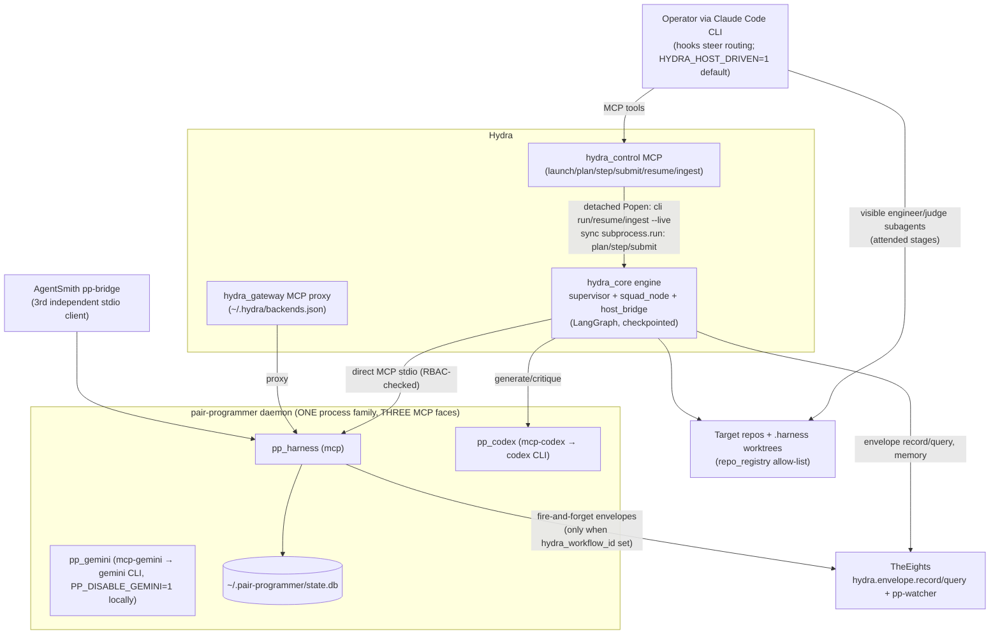
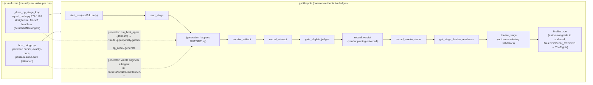
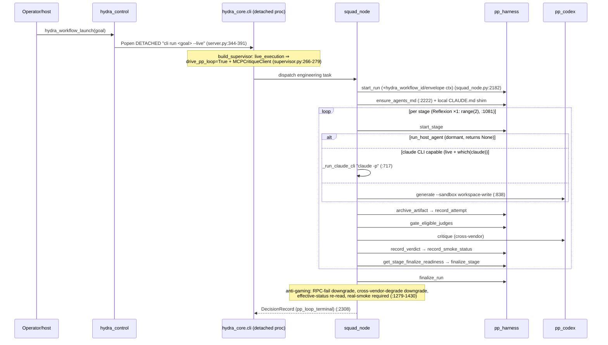
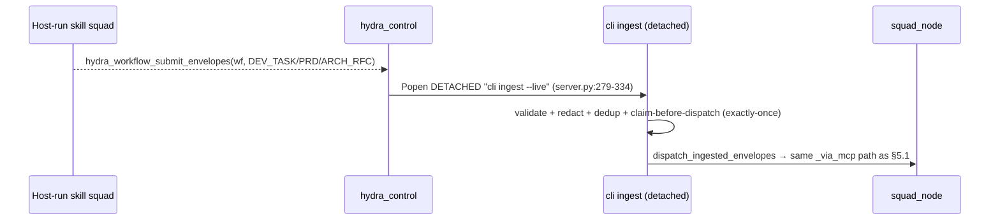

# Hydra ↔ pair-programmer — verified routing & communication audit

**Date:** 2026-07-10
**Repos:** `C:\AiAppDeployments\Hydra` (branch `fable-audit-2`), `C:\AiAppDeployments\pair-programmer`
**Supersedes:** the 2026-07-08 Copilot-session report (`hydra-pair-programmer-routing-report.md`) — this version corrects it (see §2).
**Status:** analysis only; no code changed.

## 1. Methodology

Every claim in this report survived three independent verification layers:

1. **Claude Explore sweeps** — three repo-wide agents (Hydra engine, pp daemon, long-tail seams).
2. **Direct host re-checks** — every load-bearing or conflicting claim re-read at source by the auditing session (this caught two sub-agent errors: `ack_run` *does* exist; `judge-router.md` lives in pp, not Hydra).
3. **Codex CLI adversarial verification (cross-vendor, GPT)** — all 32 claims re-verified in a read-only sandbox with instructions to refute. Verdicts: 17 CONFIRMED, 12 PARTLY (precision fixes, folded in below), 1 REFUTED-as-phrased (folded in), plus 8 additional findings (§9).

A final transcription QA of this document (anchors, matrix rows, diagram labels vs source) was run by Claude Opus (codex hit its usage limit after the three verification batches): verdict CLEAN — no factual errors; two anchor/wording imprecisions found and corrected in place.

Line numbers are as of 2026-07-10 on the branches above.

## 2. Executive summary + corrections to the 2026-07-08 report

The verified relationship in brief:

1. **pair-programmer is a passive, governed state machine.** `start_run` only scaffolds (run row, artifact dir, project lock, provenance snapshot — `runs.ts:73-228`); nothing in the daemon autonomously advances stages (the only `setInterval` is an idle-shutdown timer, `http/server.ts:87-93`). Someone external must drive the stage protocol.
2. **Hydra ships two drivers around that one pp lifecycle:** the headless straight-line loop `_drive_pp_stage_loop` (`squad_node.py:977-1452`) for detached/fleet runs, and the pause-safe persisted-cursor state machine `host_bridge.py` for attended runs. Both call the same pp ledger tools; pp is authoritative for verdict/finalize state either way.
3. **Hydra→pp is direct MCP; pp→Hydra is 100% indirect via TheEights.** pp imports no Hydra client and never calls `hydra_control`. Its only reverse-direction outputs are envelopes written to TheEights (`eights.hydra.envelope.record/query`) with circuit-breaker + degrade-to-`recorded:false` semantics.
4. **pp is completely mode-blind.** Attended vs detached Hydra look identical to the daemon; the only DB distinction between a Hydra-driven and a standalone run is whether the four `runs.hydra_*` columns are populated.

**Corrections this audit makes to the 2026-07-08 report and subsequent discussion:**

| # | Prior claim | Verified reality |
|---|---|---|
| K1 | `HYDRA_HOST_DRIVEN` is the attended/detached toggle (implying an engine branch) | The env var is read by **zero** Python files. Read sites: `.claude/settings.json:3` (default `"1"`) and `.claude/hooks/hydra-route-directive.ps1:90-93`, which only changes operator-facing guidance. The engine's real mode switch is `dispatcher.live_execution` (`dispatcher.py:151`), which `build_supervisor` uses to auto-wire `drive_pp_loop` (set-if-absent) and an `MCPCritiqueClient` (`supervisor.py:266-279`). The Python engine is mode-agnostic; it reacts to which CLI verb the host chose. |
| K2 | Generate fallback: host engineer → `claude -p` → codex on failure | The claude→codex step is a **capability gate**, not a runtime-failure fallback: `_claude_cli_generation_enabled` (`squad_node.py:764-786`) = `live_execution` AND `shutil.which("claude")`, overridable via `HYDRA_CLAUDE_ENGINEER` / `HYDRA_DISABLE_CLAUDE_ENGINEER`. A claude CLI runtime error returns `status:error` and does **not** fall through to codex. |
| K3 | `run_host_agent` is how attended generation happens | The seam is **dormant in production**: `MCPStdioDispatcher.run_host_agent` returns `None` (`dispatcher.py:485-489`, `supports_host_agent=False`), `_NullDispatcher` likewise, and `_attended_live_dispatcher` (`cli.py:1379-1387`) is a plain `MCPStdioDispatcher`. Only test doubles implement it. Real attended generation flows out-of-band through `host_bridge` + `submit_host_result`. |
| K4 | One Borda implementation mirrored | **Two distinct best-of-N implementations**: engineering best-of (`_drive_best_of_loop`, `squad_node.py:1483`; `HYDRA_BEST_OF_N` or `invoke.mode: pp_best_of` ⇒ N=3) uses pp's **server-side** `borda_count` MCP tool (`squad_node.py:1760`); executive/creative best-of (`supervisor._dispatch_best_of_n`, `supervisor.py:1220` → `judge/best_of_n.py`) uses Hydra-local `judge/borda.py`. |
| K5 | (session-hook doubt) `ack_run` may not exist | `ack_run` **exists**: tool at `harness-server.ts:609`, `ackRun` orchestrator (`runs.ts:2788`), ack columns (`database.ts:65-68`), RA-4 tests, surfaced-run banner exclusion (`hooks/dispatcher.ts:210-217`). |
| K6 | Gemini judge "retired" | Gemini is **env-gated, not retired**: `geminiEnabled()` (`config.ts:162-164`) is on unless `PP_DISABLE_GEMINI=1` — which **is set** in pp's gitignored `.claude\settings.local.json` (this deployment). Checked-in config leaves it enabled; `gate_eligible_judges`/`listAllowedJudges` (`gates.ts:292`) silently degrades the cross-vendor pair to Codex+Claude when disabled. |
| K7 | pp stores Hydra context and "injects it into prompts" | Context **is** parsed (`hydra-context.ts:46-63`) and persisted (`schema.ts:36-39`, `runs.ts:190-193`), but `renderHydraContextBlock()` / `${HYDRA_CONTEXT}` has **no production call site** — the injection described at `runs.ts:60` and `hydra-context.ts:15-16` is unwired (§9.1). |
| K8 | `judge-router.md` is a Hydra agent file | Hydra ships no `judge-router.md`; its pp-stage agents are exactly `engineer.md`, `judge-same-vendor.md`, `judge-cross-vendor.md` (Hydra's `.claude/agents/` also holds many non-pp agents). pp ships `judge-router.md` (`.claude/agents/`) and `.github/agents/judge-router.agent.md`. |
| K9 | "Two enforcement layers stack" (Hydra RBAC + pp hooks) | Stacking holds only for **host-session** tool calls: pp's `hooks.json` Pre/PostToolUse hooks fire in Claude/Copilot sessions with pp's `.claude` linked (e.g. attended subagents), **not** on Hydra's headless `dispatcher.call_mcp` stdio path. Headless engineering is protected by Hydra RBAC + pp's server-side gates only. |

## 3. System context (C4 level 1)



## 4. Container view — one pp lifecycle, two Hydra drivers (C4 level 2)



Why two drivers exist: `host_bridge.py:9-17` states it verbatim — the headless loop's broad fail-soft `except` would swallow a mid-loop pause exception and finalize the run `aborted`, so attended mode is a separate explicit step-state-machine persisting a cursor to disk; each `step`/`submit` advances exactly one transition so every pp ledger call happens exactly once.

## 5. Runtime sequence diagrams

### 5.1 Detached (`/hydra:run` when the host chooses launch)



### 5.2 Attended (`/hydra:drive`, the host session as supervisor)

```mermaid
sequenceDiagram
    participant OP as Host session
    participant HC as hydra_control
    participant CLI as hydra_core.cli (sync subprocess)
    participant HB as host_bridge
    participant PH as pp_harness
    participant ENG as engineer subagent (visible)
    participant J as judge subagent (visible)

    OP->>HC: hydra_workflow_plan(goal)
    HC->>CLI: sync "cli plan" (180s) → plan JSON in-band
    OP->>HC: hydra_workflow_step(wf)
    HC->>CLI: sync "cli step" (300s)
    CLI->>PH: start_run + ensure_agents_md
    CLI->>HB: begin_stage → start_stage; provision .harness/worktrees/attended-*
    HB-->>OP: host_action{agent_type: engineer, cwd: worktree, call_key}
    OP->>ENG: spawn Agent(engineer) — writes code in worktree
    OP->>HC: hydra_workflow_submit_host_result(generate result)
    HC->>CLI: sync "cli submit-host-result" (900s)
    CLI->>HB: apply (idempotent on call_key; mark_charged BEFORE budget write)
    HB->>PH: archive_artifact → record_attempt → gate_eligible_judges
    HB-->>OP: host_action{agent_type: judge-same-vendor | judge-cross-vendor}
    OP->>J: spawn judge (must NOT call record_verdict)
    OP->>HC: submit_host_result(judge result)
    HB->>PH: record_verdict → record_smoke_status → readiness → finalize_stage
    HB->>HB: merge worktree back BEFORE finalize_run (host_bridge.py:969)
    HB->>PH: finalize_run
```

### 5.3 Continuation ingest (host-run skill squads → engineering)



### 5.4 Engineering best-of-N (detached only)

`_drive_best_of_loop` (`squad_node.py:1483`): `start_best_of_stage` (N candidate worktrees, daemon-side) → N generations → per-candidate `gate_eligible_judges` + `record_verdict` → pp server-side `borda_count` (`:1760`) → readiness + `finalize_stage` → `archive_winner_and_losers` (merge deferred until after finalize gate; smoke-status-checked, 0-byte-diff refused) → `teardown_candidates`. Distinct from executive/creative best-of (Hydra-local `judge/borda.py`, K4).

## 6. Complete route & seam matrix

### 6.1 Primary runtime routes

| ID | Direction | Entry | Transport | What happens | Anchors |
|---|---|---|---|---|---|
| R1 | Hydra→pp | `hydra_workflow_launch` | detached CLI subprocess → direct MCP stdio | headless full stage loop (§5.1) | `server.py:344-391`; `squad_node.py:977-1452,2182,2308` |
| R2 | Hydra→pp | `plan`/`step`/`submit_host_result` | sync CLI subprocess (180/300/900s) → host_bridge → MCP | attended cursor loop, visible subagents (§5.2) | `server.py:402-452`; `host_bridge.py` (cursor `:244-260`, judge `:661,:762`, worktree `:92-124,:969`) |
| R3 | Hydra→pp | `hydra_workflow_submit_envelopes` | detached `cli ingest --live` | continuation ingest, claim-before-dispatch (§5.3) | `server.py:279-334`; `ingest.py:80-214` |
| R4 | Hydra→pp | `target_repo_id`/`--repo(s)` | registry → `project_path` arg | allow-listed repo targeting (base-escape guard, git check); attended cwd = worktree `work_path` | `repo_registry.py:186-315`; `host_bridge.py:101` |
| R5 | Hydra→pp | `--repos` fleet | threads, fresh dispatcher each | mcp-only parallel fleet; `BudgetLedger.allocate_repos` micro-dollar split; inputs prefiltered mcp-only | `fleet.py:98-133,220-288`; `state.py:45-91` |
| R6 | pp→TheEights→Hydra | `finalize_run` | fire-and-forget envelope | `DECISION_RECORD` when `hydra_workflow_id` set; degrade `recorded:false`; Hydra reads back via `eights.hydra.envelope.query` | `runs.ts:2314-2332`; `hydra-envelopes.ts:60-104`; `eights-client.ts:552-582` |
| R7 | pp→TheEights | advisory tools | envelope writes | `request_strategic_framing` (C_SUITE_DECISION_PACKET), `request_brand_review`/`request_visual_advisory` (CREATIVE_BRIEF); non-gating; replies polled via `hydra_envelope_query` | `harness-server.ts:683-790` |
| R8 | Hydra→pp | provenance fields | `start_run` args → DB | `hydra_workflow_id/_envelope_id/_origin_squad/_envelope_type` persisted; presence gates R6 emission; `${HYDRA_CONTEXT}` injection UNWIRED (§9.1) | `hydra-context.ts:46-63`; `schema.ts:36-39`; `runs.ts:190-193` |

### 6.2 Direct tool surface actually driven by Hydra

~13 of pp_harness's 69+ tools are live-called by hydra_core (`toolshed.py` PP_HARNESS_TOOLS is a static catalog, not a call map): `start_run`, `ensure_agents_md`, `start_stage`, `start_best_of_stage`, `archive_artifact`, `record_attempt`, `gate_eligible_judges`, `record_verdict`, `record_smoke_status`, `get_stage_finalize_readiness`, `finalize_stage`, `finalize_run`, `borda_count`, `archive_winner_and_losers`, `teardown_candidates`; plus `pp_codex.generate`/`critique`. `report_hydra_completion` and `hydra_envelope_query` are catalog-only in hydra_core (pp/driver-facing). RBAC: every one of these must appear in `squads/engineering/squad.yaml` `tools:` or `dispatcher._check_tool_rbac` (`dispatcher.py:232-272`) rejects mid-run.

### 6.3 Long-tail seams (verified inventory)

| # | Category | Direction | Transport | Purpose | Anchors |
|---|---|---|---|---|---|
| S1 | Config | Hydra→pp | `~/.hydra/backends.json` (from `scripts/backends.template.json`) | registers pp_harness/pp_codex/pp_gemini as **three subcommands of one daemon binary** (`node daemon/dist/index.js mcp|mcp-codex|mcp-gemini`), mirroring pp's `.mcp.json` | template `:2`; pp `.mcp.json:4`; `index.ts:34` |
| S2 | Config | pp→Hydra | `mesh-manifest.yaml` | declares `backendsKey: pp_harness`, runtime entrypoint, `healthProbe.tool: doctor` (gateway/mesh health poll) | pp `mesh-manifest.yaml` |
| S3 | Proxy | Hydra→pp | `hydra_gateway` | proxies as `mcp__hydra_gateway__pp_*__<tool>`; per-class timeouts `HYDRA_GATEWAY_TOOL_TIMEOUT_S` 120 / LONG 1800 / MAX 3600 / connect 20 | `hydra_gateway/server.py:52,300,396` |
| S4 | Dispatch | Hydra→pp | direct dispatcher | timeout tiering: `_LONG_TOOL_SERVERS={pp_codex,pp_gemini}`, `_LONG_TOOL_NAMES={generate,critique}`, `_LONG_PP_HARNESS_TOOLS={start_stage,start_best_of_stage,record_attempt,retry_with_critique}`, env `HYDRA_DISPATCH_*`, +180s stdio-teardown backstop | `dispatcher.py:163-214,339,530` |
| S5 | Hook | Hydra session | PreToolUse (Skill) | `hydra-block-direct-pp.ps1` blocks `/pp:*` action skills (read-only pp skills allowed; pp-repo cwd exempt); gate `HYDRA_ENFORCE_ROUTING=1` | hook `:9-83` |
| S6 | Hook | Hydra session | PreToolUse (Write/Edit/Bash) | `hydra-block-direct-write.ps1` + `hydra-block-bash-writes.ps1` block engine-source writes; `HYDRA_PP_STAGE_ACTIVE=1` bypass requires a **filesystem marker** (`.harness/worktrees/attended-*` or `.harness/stage-active`) — bare leaked var ignored | `hydra-block-direct-write.ps1:27-48` |
| S7 | Hook | Hydra session | UserPromptSubmit / SessionStart | `hydra-route-directive.ps1` (routing guidance; the only `HYDRA_HOST_DRIVEN` behavior site) + `hydra-session-contract.ps1` (contract scaffold; stale bits §9.3-9.4) | hooks `:38,:90-93`; `:10,:21` |
| S8 | Agents | Hydra→pp stages | subagent defs | `engineer.md` (forbidden: record_attempt/record_verdict/archive_artifact/record_smoke_status), `judge-same-vendor.md`/`judge-cross-vendor.md` ("do NOT call record_verdict — host_bridge._apply_judge records it") | `.claude/agents/*` |
| S9 | Filesystem | bidirectional | git worktrees | attended stages in `<repo>/.harness/worktrees/attended-<run>`; pp best-of candidates in `.harness/<run>/…/candidate-N`; shared `.harness` lock/artifacts | `host_bridge.py:92-124`; pp `startBestOfStage` |
| S10 | Filesystem | Hydra→target | contract files | `ensure_agents_md` after `start_run` (`squad_node.py:2222`, `cli.py:1581`) + `_maybe_write_claude_shim`; PROJECT_MASTER patched at finalize (pp tools) | — |
| S11 | Eights lane 2 | pp→eights→Hydra | pp-watcher adapters | `eights_adapters_pp_*` mirror pp runs/critiques into eights memory (keyset cursor + idempotency key after 2026-06 flood); Hydra reads via `hydra_memory` | `TheEights/daemon/src/engines/pp-watcher.ts` |
| S12 | AgentSmith | Smith→pp | own stdio client | `pp-bridge.ts` reads pp's `.mcp.json` and spawns an **independent third connection**; tools `agentsmith.pp.best_of_start` / `agentsmith.pp.borda_count`; shared DB `~/.pair-programmer/state.db` (SQLite contention under concurrent best-of unverified) | `pp-bridge.ts:4-62`; `tools.ts:476-490`; `paths.ts:9-11` |
| S13 | Budget | pp→Hydra | JSON fields on MCP returns | `cost_usd`/`total_cost_usd` **and** `tokens_in`/`tokens_out` → `charge_and_gate` on HydraState; host path: `mark_charged` cursor-before-checkpoint ordering + `already_charged` dedupe (under-charge preferred over double-charge). **Two ledgers coexist** (pp cost-tally hooks + `budget_status` vs Hydra ledger) | `squad_node.py:647`; `supervisor.py:128`; `cli.py:1692-1721` |
| S14 | Enforcement | host sessions only | pp `hooks.json` | pp's Pre/PostToolUse hooks (enforce-vendor-matrix, enforce-sandbox-policy, cost-tally, record-attempt, …) fire when Hydra-spawned **subagents** call pp tools — NOT on Hydra's headless `call_mcp` path (K9) | pp `hooks.json:42+` |
| S15 | Session surface | pp→any linked session | SessionStart hooks | daemon-up, vendor-matrix, surfaced-runs banner (excludes acked runs), PROJECT_MASTER status, eights-recall | pp `hooks.json`; `hooks/dispatcher.ts:210-217` |
| S16 | Sub-agent contract | Hydra subagents→pp | MCP | `ensure_run` (`runs.ts:262-300`) idempotent run-context for Hydra-dispatched sub-agents lacking run_id; `recordAttempt` rejects `agent_type="general-purpose"` unless `PP_STRICT_AGENT_TYPE=0` (provenance-leak guard) | `runs.ts:262-300,433-452` |
| S17 | Mirrors | code contract | Hydra-local ports | `judge/router.py` (skips envelopes with passing `pp_verdict`, `:147-184`; called `supervisor.py:1079`), `judge/reflexion.py` (port of pp `loop-ceiling.ts`), `judge/borda.py`+`best_of_n.py` (exec/creative only), `telemetry.py` (pp-compatible `trace.jsonl`), `judge/mcp_client.py` (critique envelope shape) | — |

## 7. Environment-variable matrix (READ sites in code, not docs)

| Var | Hydra read sites | pp read sites | Notes |
|---|---|---|---|
| `HYDRA_HOST_DRIVEN` | `hydra-route-directive.ps1:90-93` (guidance only); default in `.claude/settings.json:3` | none | **Never read by Python.** Engine switch = `dispatcher.live_execution`. |
| `HYDRA_ENFORCE_ROUTING` | 3 block hooks | none | Routing-enforcement kill-switch. |
| `HYDRA_PP_STAGE_ACTIVE` | 4 hooks (bypass **requires marker**); SET by `squad_node.py:716`, host_bridge | `browser-validator.md:127` (prompt-level only) | One of two vars crossing the boundary. |
| `PP_BROWSER_ENGINE` | SET (`setdefault "playwright"`) `squad_node.py:715`, `host_bridge.py:483` | `browser-validator.md:51-55` (prompt-level; **no daemon runtime read**) | Browser isolation is prompt-enforced, not daemon-enforced. |
| `HYDRA_BEST_OF_N` | `squad_node.py` (`_resolve_best_of_n`) | none | Engineering best-of opt-in; `pp_best_of` implies N=3. |
| `HYDRA_CLAUDE_ENGINEER` / `HYDRA_DISABLE_CLAUDE_ENGINEER` / `HYDRA_CLAUDE_MODEL` | `squad_node.py:707,764-786` | none | Capability gate for the `claude -p` headless engineer. |
| `HYDRA_EXTRA_REPOS` | `repo_registry.py` | none | Extends target-repo allow-list. |
| `HYDRA_GATEWAY_*` / `HYDRA_DISPATCH_*` | gateway/dispatcher timeout resolvers | none | Per-tool-class timeouts (S3/S4). |
| `PP_DISABLE_GEMINI` | none | `config.ts:162-164`; gated at `doctor()` + `listAllowedJudges` | **Active**: set in pp `.claude\settings.local.json` (gitignored). |
| `PP_STRICT_AGENT_TYPE`, `PP_ALLOW_AD_HOC`, `PP_ALLOW_BEST_OF_WITHOUT_JUDGE`, `PP_ALLOW_SMOKE_FAILED_WINNER`, `PP_HOME`/`PP_DB_PATH` | none | daemon code | pp-internal escape hatches / test isolation. |
| `AIAPP_BASE` | hooks + backends template | docs only | Ecosystem base anchoring repo discovery. |

## 8. Attended-only gap analysis — file-level change spec (NOT implemented)

**Goal:** every interactive Claude Code CLI use of Hydra drives pair-programmer attended — the host session is the supervisor, generation/judging happen as visible subagents, no `claude -p` subprocess engineers — while the Python engine stays authoritative (ledger, budget, judge routing, finalize gates).

**Ground truth this spec builds on (all verified above):** attended already exists and is exactly-once-safe (host_bridge); the engine never branches on `HYDRA_HOST_DRIVEN`; `run_host_agent` is dormant and the out-of-band cursor is the proven pattern; pp is mode-blind so no pp changes are required for engineering.

| # | Change | Files/functions | Notes & risks |
|---|---|---|---|
| G1 | Make attended the sole interactive branch of `/hydra:run` | `.claude/commands/hydra-run.md`, `.claude/commands/hydra-drive.md`, `.claude/hooks/hydra-route-directive.ps1` | Remove the detached-launch guidance for interactive sessions; `/hydra:run` always follows plan→step→submit. Doc-and-hook-only; engine untouched. |
| G2 | Retire the `claude -p` headless engineer for interactive use | default `HYDRA_DISABLE_CLAUDE_ENGINEER=1` in `.claude/settings.json` (or flip `_claude_cli_generation_enabled` default, `squad_node.py:764-786`) | Attended already never uses it (host_bridge path). This closes the residual detached-path use so no invisible Claude subprocess writes code; `pp_codex.generate` remains the detached/automation producer. Risk: detached runs lose the Claude generator entirely — acceptable if detached is demoted (G4). |
| G3 | Extend host_action beyond engineering (the real missing piece) | `hydra_core/host_bridge.py` (new cursor kinds), `hydra_core/cli.py` step/submit plumbing, `mcp_servers/hydra_control/server.py` (surface new action types), `supervisor.py:1919-1926` (live-defer → emit host_action instead of `deferred_to_host` dead-end) | New `host_action.agent_type` values for `claude-skill` / `agent-impersonation` squads so executive/garland/marketing work also runs as visible subagents inside the attended loop. Keep `run_host_agent` dormant — the out-of-band cursor is the proven, pause-safe pattern. Ingest (`submit_envelopes`) remains the re-entry transport and needs no change. Largest work item; needs RA-12-class mode-boundary regression tests (attended-complete tasks must not re-dispatch headless on resume). |
| G4 | Demote detached to automation-only | `mcp_servers/hydra_control/server.py` (`_launch_run`, detached resume): env-gate behind e.g. `HYDRA_ALLOW_DETACHED=1`; keep for fleet/cron/non-Claude callers | plan/step/submit becomes the only sanctioned interactive surface. Risk: external machine callers depending on `hydra_workflow_launch` must set the gate. |
| G5 | Parallelism policy | none (decision) | Recommended: fleet/campaign (`--repos`) stays detached — the attended cursor is single-stream by design and a multi-cursor host bridge is a major redesign. Document the boundary in `hydra-campaign.md`. |
| G6 | Durability/timeout hardening for attended-first | `mcp_servers/hydra_control/server.py` timeout constants (SUBMIT 900s vs long stages); document `/hydra:drive` resume; verify `already_charged`/`mark_charged` parity holds for new G3 action types | Long attended stages (big diffs, slow judges) must not blow the sync-submit ceiling; consider raising or chunking. |

Suggested sequencing: G1+G2 (config/docs, immediate) → G4 (small server change) → G3 (engine work, with tests) → G6 → G5 (documentation).

## 9. Defects & drift found during verification (not fixed here)

1. **Unwired `${HYDRA_CONTEXT}` injection** — `renderHydraContextBlock()` (`hydra-context.ts:73`) has tests but no production call site; `runs.ts:60` documents injection that never happens. Hydra-driven sub-agents don't actually see the Hydra context block in prompts.
2. **Dead detection probe** — `hydra-session-contract.ps1:21` and `hydra-route-directive.ps1:38` probe `~/.pp/harness.db`; pp's real DB is `~/.pair-programmer/state.db` (`paths.ts:11`) and `~/.pp/harness.db` does not exist. The hooks still detect pp via their primary checks (`hydra-route-directive.ps1:36` tests `daemon/dist/index.js`; `hydra-session-contract.ps1:14-18` matches a running `node … pair-programmer` process).
3. **Stale hook warning** — `hydra-session-contract.ps1:10` still claims a leaked `HYDRA_PP_STAGE_ACTIVE=1` "silently disables routing enforcement"; the bypass now requires filesystem markers (S6).
4. **Stale AgentSmith docs** — `AgentSmith/AGENTS.md:37` and `factory/best-of-n.ts:6` say the pp-bridge is unimplemented; `bridges/pp-bridge.ts` + `tools.ts:476-490` implement it.
5. **Enforcement asymmetry** — pp's client-side hooks don't cover Hydra's headless dispatch (K9); headless integrity rests on Hydra RBAC + pp server-side gates (which are strong: vendor pinning `runs.ts:616-720`, Reflexion×1/loop-ceiling `loop-ceiling.ts:54-68`, findings_closed rejudge + PP-VG-6 hallucination gate, finalize auto-downgrade `runs.ts:1637-1668`).
6. **Sandbox trust boundary** — `pp_codex` `--sandbox workspace-write` for editing stages is caller-side convention; the server schema also accepts `danger-full-access` (`codex-server.ts`).
7. **Doc drift on the mode toggle** — CLAUDE.md/ARCHITECTURE.md imply `HYDRA_HOST_DRIVEN` switches the engine; it only steers host command choice (K1).

## 10. What does NOT exist (verified absences)

- No pp→`hydra_control` call path; no direct HTTP/gRPC/WS link between the repos (pp's `127.0.0.1:7878` HTTP server is its own read-only control plane).
- No autonomous stage driver inside the pp daemon.
- No `driver`/`origin` column distinguishing Hydra-driven runs — only `hydra_*` NULL/non-NULL.
- No Python read site for `HYDRA_HOST_DRIVEN`; no pp daemon read site for `HYDRA_PP_STAGE_ACTIVE` or `PP_BROWSER_ENGINE`.
- No production implementation of `Dispatcher.run_host_agent` (test doubles only).

## 11. Evidence index (verified anchors)

**Hydra:** `squad_node.py` :707-844 (generate chain, claude -p :717, capability gate :764-786), :977-1452 (headless loop; Reflexion :1081; anti-gaming :1279-1430), :1483-1877 (best-of), :2182-2308 (_via_mcp, DecisionRecord); `dispatcher.py` :151 (live_execution), :163-214/:339/:530 (timeouts), :232-272 (RBAC), :460-489 (host seam); `supervisor.py` :266-279 (auto-wire), :1079 (judge router call), :1220 (exec/creative best-of), :1919-1926 (live defer, stub carve-out); `host_bridge.py` :9-17, :92-124, :244-260, :661, :762, :942-969, :1180; `cli.py` :1379-1387, :1581, :1692-1721; `hydra_control/server.py` :227-452, :1018-1125, :1396; `fleet.py` :98-133, :220-288; `state.py` :45-91 (BudgetLedger.allocate_repos); `repo_registry.py` :186-315; `judge/router.py` :147-184; `telemetry.py` :3-20; hooks as cited in §6.3/§9.

**pair-programmer:** `runs.ts` :73-228 (startRun), :262-300 (ensure_run), :433-452 (agent-type guard), :616-720 (vendor pinning), :1029-1228/:1414/:1444 (finalize gates), :1637-1668 (auto-downgrade), :2275-2332 (finalize side effects + DECISION_RECORD), :2788 (ackRun); `harness-server.ts` :609 (ack_run), :683-790 (Hydra-protocol tools), :1011-1098 (best-of tools), :1258-1283 (gates); `loop-ceiling.ts` :54-68; `hydra-context.ts` :15-16, :46-63, :73; `hydra-envelopes.ts` :60-104; `eights-client.ts` :552-596; `schema.ts` :36-39; `config.ts` :112-115, :162-164, :198-223; `codex-server.ts` :156-200, :360-448; `gemini-server.ts` :92, :183; `paths.ts` :9-11; `hooks/dispatcher.ts` :210-217; `.claude\settings.local.json` (PP_DISABLE_GEMINI=1).

**Third systems:** `AgentSmith/daemon/src/bridges/pp-bridge.ts` :4-62; `AgentSmith/daemon/src/mcp/tools.ts` :476-490; `TheEights/daemon/src/engines/pp-watcher.ts`.

---

## 12. Implementation status (remediation program, 2026-07-11 → 2026-07-12)

Every item below landed through attended Hydra runs (engine source) or direct
edits (docs/hooks/config) per the approved remediation plan, each phase
validated with a real Hydra run. Hydra branch `fable-audit-2`; pp and
AgentSmith on their `fable-audit-2` branches.

### §8 spec — all six items IMPLEMENTED

| Item | Status | Commits / evidence |
|---|---|---|
| G1 attended-sole-interactive | DONE | Hydra `a48fe31` (hydra-run.md always-attended, unconditional hook directive, `HYDRA_HOST_DRIVEN` fully retired — zero read sites). Live-validated: full attended run on mu-fleet-scratch, zero `launch` calls, merge-back `debeac5`. |
| G2 no interactive `claude -p` | DONE | `HYDRA_DISABLE_CLAUDE_ENGINEER=1` in `.claude/settings.json` (`a48fe31`); `_claude_cli_generation_enabled` already honored it. |
| G3 non-eng attended path | DONE (was mostly pre-built) | Proof + pinning via `22b7719`/`0ff06c7` (e2e squad-cursor CLI test, RA-12a assertion) + `c9b87b2` (hydra-drive.md squad host_action shape). Live-validated: executive-pack attended run (CEO brief), charge-once on duplicate submit, no re-dispatch. |
| G4 detached gate | DONE | Hydra `04ecdbc` (gate `_launch_run`/`_launch_resume` behind `HYDRA_ALLOW_DETACHED=1`, structured refusal, fleet-goal auto-exempt with boundary-tightened regex, ingest ungated) + `a177e48` (approve/resume docs). Codex cross-vendor judge: revise→Reflexion→pass 9/9/9. Gate live-verified in fresh process; **full MCP-path check pends the next session restart**. Pre-checks: no external launch callers, no crons. |
| G5 fleet stays detached | DONE (doc) | `c329af8` (hydra-campaign.md) + fleet auto-exemption in G4's gate. |
| G6 timeout/durability | DONE | Hydra `7631377` (step 900s / submit 1800s defaults; timeout errors carry remediation + `stale_state`; baseline `<sha>.timeout.json` degraded marker ends infinite suite re-pay) + `f90369c` (resume-after-timeout runbook). Live evidence that motivated the additions: two step-ceiling kills mid-baseline with stale lock/run/worktree, baseline never cached on timeout. |

### §9 defects — all seven RESOLVED (or accepted+documented)

| # | Status | Evidence |
|---|---|---|
| 9.1 `${HYDRA_CONTEXT}` unwired | **WIRED FOR REAL** | pp returns `hydra_context_block` from `start_run`/`ensure_run` (pp `98422d1` lineage, 7a); Hydra injects into all three generation prompts incl. attended Reflexion retries (Hydra `d0cd89b`, 7b; codex caught + fixed a retry-drop bug). Live-proven: fresh attended run's engineer prompt STARTS with `## Hydra context` + workflow id; stale doc comments rewritten. |
| 9.2 dead `~/.pp/harness.db` probes | FIXED | `c329af8` — both hooks now probe `~/.pair-programmer/state.db`. |
| 9.3 stale bypass warning | FIXED | `c329af8` — RA-1 line reworded (marker-required semantics); stale test assertion updated in `04ecdbc`. |
| 9.4 stale AgentSmith docs | FIXED | AgentSmith `1d934c5` (AGENTS.md) + `c5baf14` (best-of-n.ts comment, via cross-repo attended run). |
| 9.5 enforcement asymmetry | DOCUMENTED + partially closed | `c329af8` (ARCHITECTURE.md layers note); server-side closure via 9.6 + LV-4. |
| 9.6 sandbox trust boundary | **SERVER-SIDE DENY** | pp `831f099`: `assertSandboxAllowed` rejects `danger-full-access` unless `PP_ALLOW_DANGER=1` on the headless MCP generate path; 6 unit tests. |
| 9.7 mode-toggle doc drift | FIXED | `c329af8` + `a48fe31` (CLAUDE.md/ARCHITECTURE.md; toggle retired outright). |

### New findings from live validation (LV series)

| # | Finding | Status |
|---|---|---|
| LV-1 | host_bridge ignored MCP tool-error *payloads* (dispatcher returns error dicts, never raises) — a rejected `record_verdict` passed silently and a stage finalized `complete` with zero verdict rows | FIXED `22b7719`: `_raise_on_error_payload` on 10 ledger call sites; regression tests |
| LV-2 | attended `start_run` omitted all `hydra_*` fields → R6 DECISION_RECORD never emitted for attended runs | FIXED `22b7719`: cli threads workflow/envelope ctx; live-verified non-NULL |
| LV-3 | `judge-same-vendor.md` instructed the exact producer label pp's vendor pinning rejects when models collide | FIXED `62a6a7c` (contract → `claude-same-vendor-host`) + `22b7719` (host_bridge normalization); live-verified relabel in ledger |
| LV-4 | pp `getStageFinalizeReadiness` passed stages with ZERO non-retracted verdicts (only blocked on latest-fail) | FIXED pp `831f099`: `zero_verdict` blocker; 8 unit tests + `finalize-gates-c` aligned (`d117691`) |
| LV-5 | attended smoke has no story for non-Python repos (and worktrees lack node_modules) → TS-repo attended runs surface at PP-VG-5 by design | ACCEPTED + operator preserve-and-merge pickup protocol used; backlog: per-repo smoke_cmd for TS repos |
| LV-6 | pp readiness MCP tool structurally could never return `finalize_passed` for code stages (schema stripped `winner_attempt_id`) | FIXED pp `d2a8269`: schema widened + threaded; tests |
| LV-7 | pp's own test drift: `smoke.mjs` predated PP-VG-2/VG-5 gates (fixed across `747a26c`/`6c5adff`/`7ed0655`/`8c0df0c`/`0a9c3aa` — now ALL SMOKE CHECKS PASSED); `eights-integration.smoke.mjs`, `artifact-validators.smoke.mjs`, `agents-md.unit.mjs`, `shutdown.unit.mjs`, `finalize-gates-a.unit.mjs` fail identically pre-remediation (environmental/drift) | smoke.mjs FIXED; remaining five documented pp backlog (verified pre-existing on `276ff0b`) |

### Activation requirements (pending operator restart)

- **Session restart** re-spawns `hydra_control` → activates the G4 detached
  gate and G6 timeout defaults on the MCP path (validated in fresh processes +
  unit tests meanwhile).
- **pp daemon restart** (`npm run build` already done; restart the daemon +
  gateway) → activates the sandbox deny, zero-verdict blocker, readiness
  winner param, and `hydra_context_block` on live MCP traffic. The Hydra-side
  injection (7b) is already active (hydra_core loads per CLI call) — proven
  live against the rebuilt daemon.
