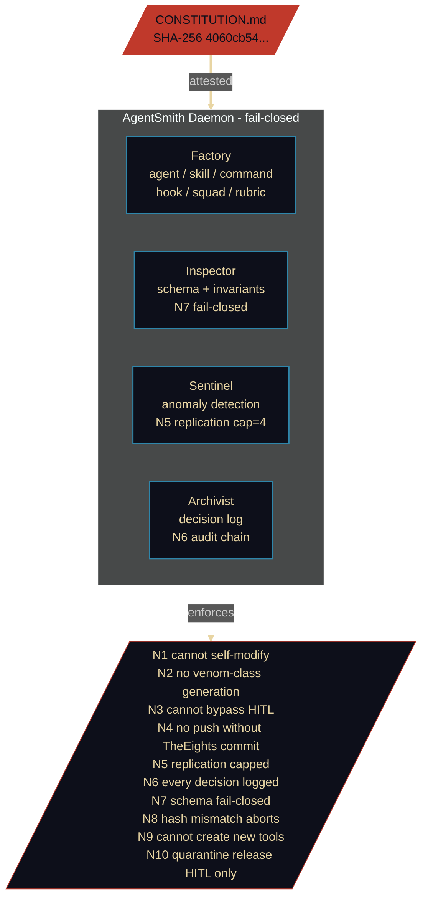
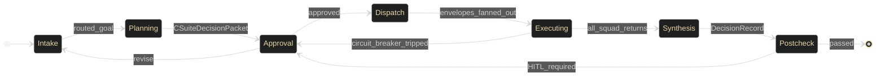
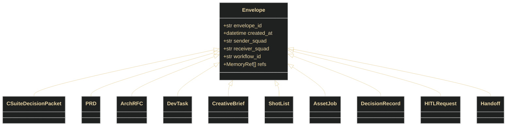
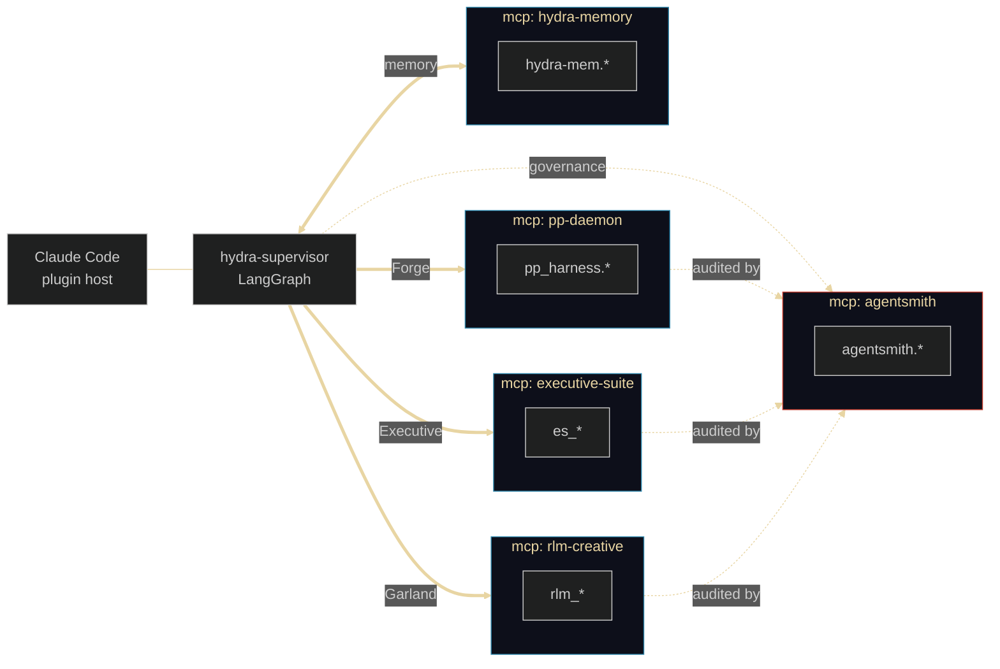
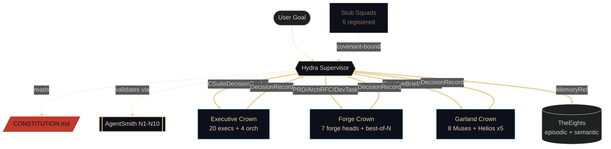
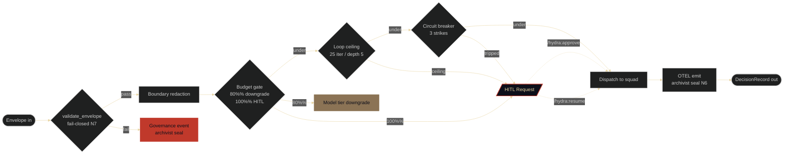
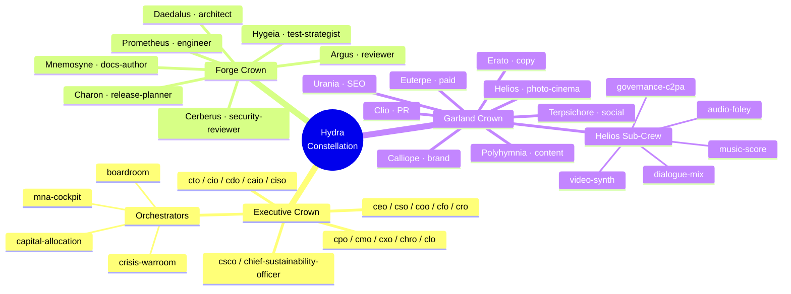

# Hydra Constellation
### The Three Crowns, the Immortal Head, and the Eight-Cell Substrate

> *Many heads. One Spirit. The covenant holds.*

**Date:** 2026-05-19
**Constitution SHA-256:** `4060cb542fcc701143e56ec7b1608584b7c399d878db193dbf81c0f9dad6cfa5`
**Format:** GitHub-renderable canonical deck (Mermaid + SVG inline).
**Companion deliverables:** [`deck.html`](./deck.html) (self-contained reveal.js), [`constellation.svg`](./constellation.svg) (poster), [`garland/creative-direction.md`](./garland/creative-direction.md) (Garland cinematic treatment), [`exec-memos/`](./exec-memos/) (CSO, CTO, CAIO).

---

## The Poster


---

# Act I — The Covenant

## 1. The Constellation

The largest constellation in the night sky has no bright stars. Hydra — the water snake — holds 1,303 square degrees through the pattern of its relationships, not through luminosity. This system holds its shape the same way.

## 2. Mark 5:9 vs Acts 2

| Legion | Pentecost |
|---|---|
| *"My name is Legion, for we are many."* (Mark 5:9) | *"There appeared unto them cloven tongues like as of fire."* (Acts 2:3) |
| Many spirits, one body — coordination through merger, identity through dis-integration. | One Spirit, many bodies — distributed agency, single covenant, no loss of self. |
| The flat agent mesh. | The Hydra Constellation. |

## 3. The Immortal Head

`CONSTITUTION.md` carries a SHA-256 hash verified at every session boundary. No agent modifies it. Proposed edits surface as HITL events. Cut every other head and rebuild it. You cannot cut that.

**Currently:** `4060cb542fcc701143e56ec7b1608584b7c399d878db193dbf81c0f9dad6cfa5`

Enforced by **AgentSmith invariant N8** — hash mismatch aborts the session.

## 4. Three Crowns

| Crown | System | Optimized for | Entrypoint |
|---|---|---|---|
| **Executive** | ExecutiveSuite | judgment under ambiguity | agent-impersonation |
| **Forge** | pair-programmer | verifiable correctness (best-of-N) | MCP (pp-daemon) |
| **Garland** | RLM-Creative | divergent ideation, multi-modal synthesis | claude-skill |

Plus five stub squads — legal-compliance, healthcare, sales-gtm, research-ds, customer-support — registered under the same covenant, awaiting promotion.

## 5. TheEights — The Memory Substrate

Eight I Ching trigrams. Eight memory cells. One substrate.

| Trigram | Pinyin | Cell | Domain |
|---|---|---|---|
| ☰ | Qian | Heaven | Vision — constitutional ground truth |
| ☷ | Kun  | Earth  | Context — persistent world state |
| ☳ | Zhen | Thunder | Triggers — event-driven activations |
| ☴ | Xun  | Wind   | Influence — propagation across squads |
| ☵ | Kan  | Water  | Risk — exposures, anomalies, KRIs |
| ☲ | Li   | Fire   | Focus — current attention, hot path |
| ☶ | Gen  | Mountain | Constraints — guardrails, budgets, refusals |
| ☱ | Dui  | Lake   | Delight — qualitative satisfaction, brand voice |

Episodic memory lives at `~/.hydra/episodic.db` (append-only SQLite). Semantic memory at `~/.hydra/vectors/` (per-squad). Cross-squad reads go through **`MemoryRef` handles** — never raw blobs.

## 6. The Venom Gate

AgentSmith's four pillars: **Factory, Inspector, Sentinel, Archivist**. Ten fail-closed invariants (N1–N10). Smith does not advise. Smith enforces.



## 7. Regulatory Posture

| Framework | Hydra Mechanism |
|---|---|
| **EU AI Act Article 9** (risk management) | constitution + envelope validation + circuit breaker |
| **EU AI Act Article 50** (transparency, from Aug 2026) | typed envelope provenance + DecisionRecord audit chain |
| **NIST AI RMF 1.0 + Agentic Profile** (Feb 2026) | Govern (invariants), Map (routing), Measure (OTEL), Manage (HITL) |
| **ISO/IEC 42001** (AI management system) | continuous artifact generation per workflow |

## 8. Act I Close

One hash. One document. Everything downstream is answerable to it.

---

# Act II — The Architecture

## 9. The 7-Phase State Machine (D2)



## 10. The Envelope Schema (D7)



Every cross-squad message is one of ten validated types. `hydra_core.schemas.validate_envelope` is fail-closed (N7). A malformed envelope is a *governance event*, not a runtime error.

## 11. MCP Host Topology (D4)



**Blast radius equals namespace.** A failure or prompt injection in one crown cannot reach into another.

## 12. The Squad Orchestration Graph (D3)



## 13. The Executive Crown — ExecutiveSuite

**20 specialist execs + 4 orchestrators.** Agent-impersonation entrypoint. Optimized for judgment under ambiguity.

Roster: `ceo, cso, coo, cfo, cro, cto, cio, cdo, caio, ciso, cpo, cmo, cxo, chro, clo, chief-communications-officer, chief-compliance-officer, chief-risk-officer, csco, chief-sustainability-officer`.

Orchestrators: `boardroom, mna-cockpit, crisis-warroom, capital-allocation`.

Skills: `executive-protocol, financial-frameworks, ai-governance, debate-protocol, scenario-planning, enterprise-risk, mna-playbook, crisis-response, stakeholder-comms`.

## 14. The Forge Crown — pair-programmer

**7 forge heads.** MCP entrypoint via `pp-daemon` (~42 tools). Best-of-N harness with Borda count and Reflexion ×1.

| Mythic | Functional | Owns |
|---|---|---|
| Daedalus | architect | ADRs, C4 sketches |
| Prometheus | engineer | code generation |
| Argus | reviewer | code review verdicts |
| Hygeia | test-strategist | test strategy, performance budgets |
| Cerberus | security-reviewer | threat models, control mappings |
| Charon | release-planner | rollout, rollback, runbooks |
| Mnemosyne | docs-author | changelogs, release notes, runbooks |

Sixteen built-in profiles: `web-ui, api-platform, internal-tool, enterprise, ai-agentic, mobile, sdk, data-product, embedded, non-ui-cli, game-dev` family.

## 15. The Garland Crown — RLM-Creative

**8 Muses + Helios sub-crew (5).** Claude-skill entrypoint.

| Muse | Domain |
|---|---|
| Calliope | brand strategy |
| Erato | copywriting |
| Polyhymnia | content strategy |
| Terpsichore | social / community |
| Euterpe | paid acquisition |
| Clio | PR / earned |
| Urania | SEO / discovery |
| Helios | photo / cinema lead |

Helios sub-crew: `video-synth, audio-foley, music-score, dialogue-mix, governance-c2pa` (the last enforces C2PA content provenance — Article 50 obligation).

## 16. AgentSmith — The Four Pillars

See diagram in §6. Smith enforces N1–N10 with no exceptions. Appeals via the **cerberus-bridge** protocol — false-positive and false-negative refusals route to immortal-head review.

## 17. Act II Close — Routed. Typed. Enforced. Logged. Governed.

Five verbs. Each maps to a subsystem. The architecture is the guarantee.

---

# Act III — Governance & ROI

## 18. Constitutional ROI

The constitution is not overhead. It is the product.

- Every typed envelope → compliance artifact.
- Every HITL event → audit log entry.
- Every hash verification → governance attestation.

Hydra **generates** compliance as a byproduct of operation. It does not bolt it on.

## 19. EU AI Act Article 9 — Lived

| Article 9 obligation | Hydra mechanism |
|---|---|
| Identification of risks | squad-boundary redaction; venom-class detection |
| Estimation / evaluation | envelope schema validation (N7) |
| Risk mitigation | circuit breaker, loop ceiling, HITL gate |
| Testing | best-of-N + cross-vendor judge plane |
| Continuous monitoring | OTEL emit at every phase |
| Documentation | archivist seal (N6); replay-deterministic trace |

## 20. The HITL Gate (D9)



A paused workflow resumes only by human hand. No bypass. No timeout resumption.

## 21. The Squad Expansion Model

Five squads are stubs. *That is the design.* Legal-compliance, healthcare, sales-gtm, research-ds, customer-support — all registered under `squads/<slug>/squad.yaml`, all governed by the covenant, none yet operational.

Adding a squad means **one `squad.yaml` + one typed entrypoint**. The covenant scales without renegotiation.

## 22. Failure Modes & Mitigations

| Failure mode | Invariant / Control | Mitigation |
|---|---|---|
| MAS coordination collapse | typed envelopes | `validate_envelope` fail-closed (N7) |
| Runaway agent loop | loop ceiling | 25 iter / depth 5; HITL on breach |
| Constitution drift | hash pin | N8 aborts session on mismatch |
| Replication explosion | replication cap | N5 caps at 4 clones per scope |
| Venom-class capability generation | refusal registry | N2 fail-closed; cerberus-bridge for appeal |
| Push without verdict | TheEights gate | N4 requires evolution.commit before push |
| Schema malformity | envelope validator | N7 fail-closed |
| Tool inflation | factory ban | N9 — Smith cannot create new tools |
| Quarantine bypass | release gate | N10 requires TheEights HITL |
| Audit silence | decision log | N6 — every Smith decision logged |

## 23. The Pentecost Frame — Final Statement

Hydra is not Legion — it does not seek merger or dominance. Six squads, three crowns, one constitution. The distributed agency is not a bug in the governance model. It *is* the governance model.

## 24. For the Builder

```yaml
# squads/<your-slug>/squad.yaml
slug: your-squad
version: 1.0.0
entrypoint: mcp           # or: claude-skill | agent-impersonation
namespace: your-namespace
agents:
  - name: your-agent
    role: your-role
risk_class: low           # low | medium | venom
allow_list:
  - tool: external.api.read
constitution_attest: required
```

Read [`CONTRIBUTING-SQUADS.md`](../CONTRIBUTING-SQUADS.md). Register your slug. Define your envelope schema. Wire your entrypoint. Submit for constitution review. **The immortal head decides.**

You don't have to rebuild the governance layer — it's already there.

---

## Coda — The Largest Constellation

Hydra. 1,303 square degrees. Holding.

The largest constellation has no bright stars. It holds its shape not by luminosity but by the pattern of its relationships. So does this system. The covenant is the shape.

---

## Appendix A — Three Crowns Roster (D8)



## Appendix B — Executive Memos

- [CSO — Strategic Case for Constellation Architecture](./exec-memos/cso.md)
- [CTO — Architectural Reference](./exec-memos/cto.md)
- [CAIO — AI Governance Posture](./exec-memos/caio.md)

## Appendix C — Garland Cinematic Treatment

- [Garland Creative Direction (brand voice, art direction, slide outline, narration, asset list, accessibility)](./garland/creative-direction.md)

## Appendix D — Research Notes (Phase 4)

- [Web research — LangGraph 2026, EU AI Act, NIST RMF, reveal.js](./assets/research-notes.md)

---

*Filed under the covenant. SHA-256 attested. Pentecost, not Legion.*
